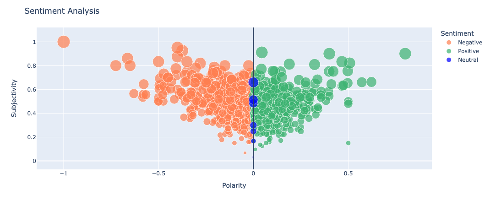
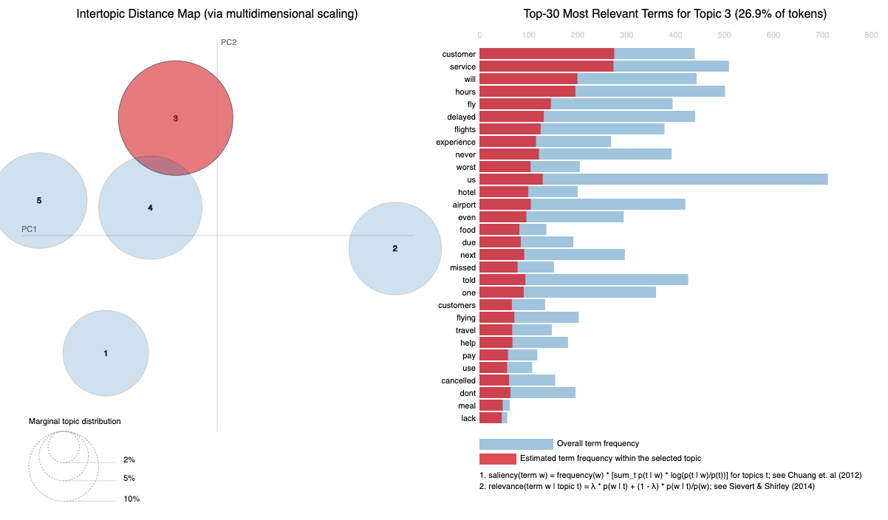

# American Airlines Customer Review Analysis

**A text analytics project focused on extracting insights from airline customer feedback.**

---

## Summary

This project explores customer reviews for American Airlines to understand key themes, sentiment trends, and potential areas for service improvement.

---

## Objectives

- Analyze review content to uncover common complaints or praise.
- Quantify sentiment using NLP techniques.
- Provide data-driven suggestions for customer experience improvements.

---

## Files

| File | Description |
|------|-------------|
| [`script.ipynb`](./script.ipynb) | Main notebook with data cleaning, EDA, sentiment analysis |
| `README.md` | Project overview and instructions |

---

## Methods & Tools

- **Text Cleaning**: stopword removal, lemmatization
- **Visualization**: Word clouds, sentiment distributions
- **NLP**: VADER Sentiment Scoring (NLTK)
- **Python Libraries**: Pandas, Matplotlib, NLTK, WordCloud

---

## Key Insights (Examples)

- Reviews mentioning “delay”, “cancel”, and “rude” were heavily negative.
- Positive reviews often highlighted “crew”, “smooth flight”, and “upgrade”.
- Sentiment polarity skewed more negative than expected (based on distribution).

---

## Sample Visuals

### Sentiment Distribution
  
*Customer review sentiment scores, using TextBlob polarity and subjectivity.*

### Topic Modeling: Top Complaints
  
*Topic 3 (26.9% of tokens) centers around complaints about customer service, flight delays, and hotel accommodations.*

---

## Business Impact

These insights can help:
- **Customer service** teams prioritize common complaints
- **Marketing** target improvement narratives
- **Product teams** address specific route or timing issues

---

## Next Steps

- Train a topic model (LDA) to cluster reviews by theme
- Build a Streamlit dashboard to explore sentiment by route
- Compare with competitor airline reviews (Delta, United)